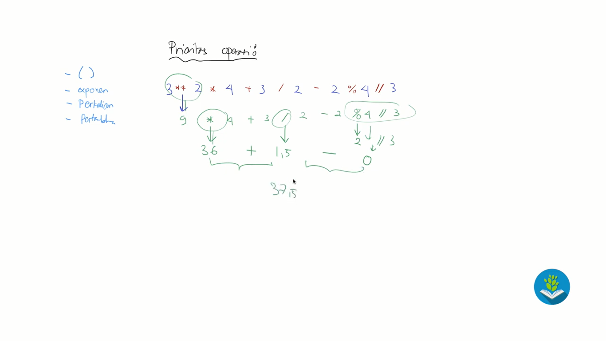

# Prioritas operasi / operational precedence :
- Contoh = 3 ** 2 * 4 + 3 / 2 - 2 % 4 // 3
- Urutannya yg akan dikerjakan dulu adalah = 
1. ()
2. eksponen
3. perkalian/pembagian/modulus/floordivision
4. pertambahan/pengurangan

Untuk lebih jelasnya lihat aja di gambar

